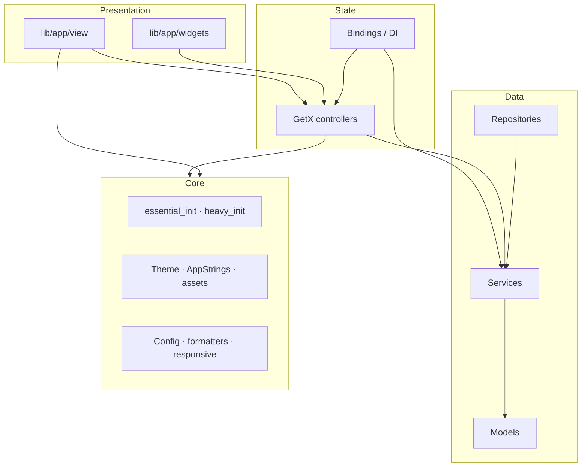
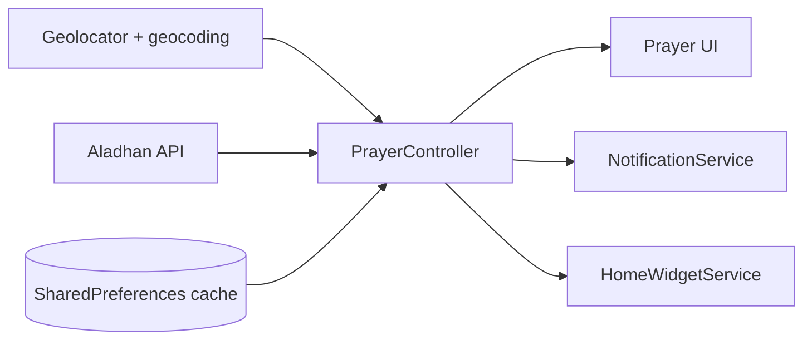
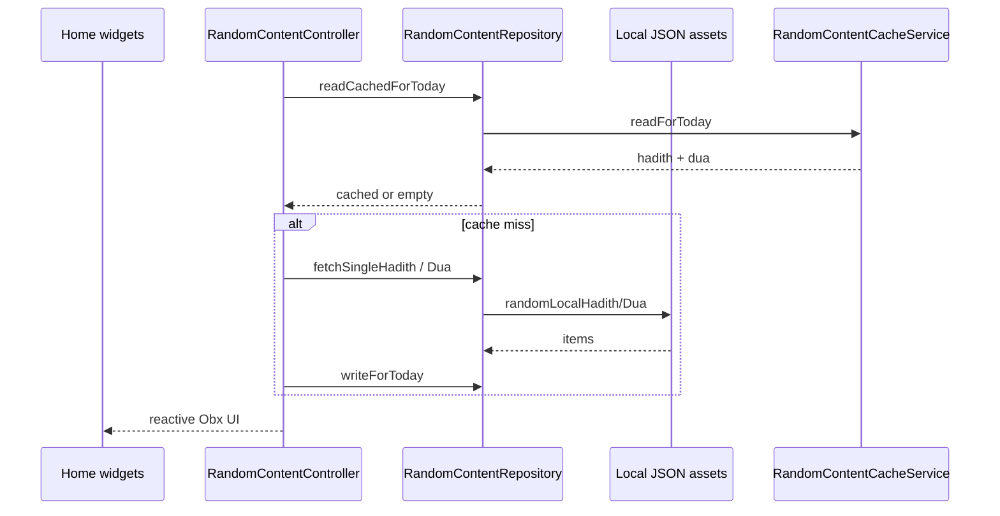

<div align="center">


# Rafiq Al-Dhikr

**Arabic:** رفيق الذكر

**Portfolio document** — detailed feature breakdown and how each area was implemented.  
For the Arabic-first guide with screenshots, see the [app repository README](https://github.com/Si1verSurfer/Rafiq-Al-Dhikr/blob/main/README.md).

**Stack:** Flutter · Dart 3.9+ · GetX · Material · `quran_library` · Aladhan API · local notifications & widgets  

[Issues](https://github.com/Si1verSurfer/Rafiq-Al-Dhikr/issues)

</div>

---

## Table of contents

1. [Executive summary](#executive-summary)  
2. [App bootstrap & core infrastructure](#app-bootstrap--core-infrastructure)  
3. [Prayer times & location](#prayer-times--location)  
4. [Notifications & scheduling](#notifications--scheduling)  
5. [Qibla compass](#qibla-compass)  
6. [Qur’an reader & last read](#qurân-reader--last-read)  
7. [Adhkar (daily remembrances)](#adhkar-daily-remembrances)  
8. [Tasbīḥ (digital counter)](#tasbīḥ-digital-counter)  
9. [Hadith — Nawawi’s Forty](#hadith--nawawis-forty)  
10. [Hadith / Du’ā of the day](#hadith--duâ-of-the-day)  
11. [Home screen widget & deep links](#home-screen-widget--deep-links)  
12. [Achievements & daily progress](#achievements--daily-progress)  
13. [Theming & UX](#theming--ux)  
14. [Architecture diagrams](#architecture-diagrams)  
15. [Build, test, license](#build-test-license)

---

## Executive summary

**Rafiq Al-Dhikr** is a production-oriented Flutter app for Muslim daily practice: **prayer times** tied to the user’s location, **Qur’an** reading with progress sync, structured **adhkar**, a **tasbīḥ** counter, **Hadith** (Nawawi 40), rotating **hadith/du’ā of the day**, **qibla** with sensor fusion and optional **magnetic declination**, plus **local notifications**, **home widgets**, and **deep links**.

State and navigation use **GetX** (`GetMaterialApp`, controllers, bindings). Data comes from **bundled JSON**, **HTTP** (prayer API, optional NOAA for declination), **SharedPreferences**, and **GetStorage**. The codebase separates **`lib/app`** (UI, controllers, services) and **`lib/core`** (init, theme, strings, utilities).

---

## App bootstrap & core infrastructure

### What it does

Cold start initializes storage and libraries, aligns **timezone** with the device, sets up **notifications**, and defers **home widget** work to after the first frame (to avoid iOS preference warnings).

### How it was built

- **`main.dart`** — `WidgetsFlutterBinding.ensureInitialized()`, registers `ThemeController` with `Get.put(..., permanent: true)`, awaits **`initEssential()`**, then `runApp`. **`HomeWidgetService.initialize()`** runs in a **post-frame callback** so the UI tree exists first.
- **`lib/core/init/essential_init.dart`** — **`GetStorage.init()`** and **`QuranLibrary.init()`** for lightweight persistence and mushaf package setup. Loads timezone data, calls **`FlutterTimezone.getLocalTimezone()`** and **`tz.setLocalLocation`** so scheduled notifications use real local time. Invokes **`NotificationService.initializeBasic()`**.

Together this gives a predictable startup path: essential I/O and time locale before any prayer scheduling UI runs.

---

## Prayer times & location

### What it does

Shows **Fajr through Ishā** (and sunrise) for **today**, resolves **city/country** for display, drives a **live countdown** to the next prayer, falls back to **cached** times and a **default city** when GPS or network fails, and picks an **appropriate fiqh calculation method** by country.

### How it was built

- **`PrayerController`** (`lib/app/controllers/prayer_controller.dart`) — GetX observables for times, loading, errors, city/country, next prayer name, and countdown. **`initialize()`** loads cache first (`_loadCachedDataQuickly`), then **`updateAndScheduleIfNeeded()`** to refresh from the network when appropriate. A **periodic `Timer`** updates the countdown UI. Integrates **`HomeWidgetService`**, **`WatchSyncService`**, **`ScheduleManager`**, and **`NotificationService`** when data changes.
- **`ApiService.fetchPrayerTimes`** (`lib/app/services/api_service.dart`) — Builds an **Aladhan** `timings` URL with latitude, longitude, **method** (from `_methodForCountry`: KSA, Egypt, Gulf, Singapore, North America, etc.), and optional **IANA timezone** string so API times match the device calendar day.
- **`LocationService.getCurrentLocation`** (`lib/app/services/location_service.dart`) — **Geolocator** with high accuracy and timeout; **geocoding** for city/country; **deduplicates** concurrent requests via an internal guard; caches last good position in **SharedPreferences**; falls back if permission denied or services off.
- **`CacheService`** (`lib/app/services/cache_service.dart`) — Serializes **`PrayerTimes`** to JSON in SharedPreferences with a **cache version** and date stamp; supports reading **stale** cache for instant UI while refreshing.
- **`ScheduleManager`** (`lib/app/services/schedule_manager.dart`) — Persists **“last schedule date”** so prayer notifications are **reshuffled once per day** rather than duplicated.

This stack prioritizes **fast paint** (cache), then **accuracy** (fresh API + correct method + timezone string).

---

## Notifications & scheduling

### What it does

**Prayer-time** notifications with **custom azan raw sounds** on Android, separate channels for **adhkar/reminders** and **progress**, plus optional daily prompts (e.g. morning/evening adhkār, Surah al-Kahf Friday, daily progress reminder).

### How it was built

- **`NotificationService`** (`lib/app/services/notification_service.dart`) — **`flutter_local_notifications`** with Android **notification channels** (`Importance.max` for prayer, high for reminders). Initializes **timezone database** (`timezone` package). **Azan sound** resolved from SharedPreferences with a **whitelist** (`_validAzanSounds`) so corrupt prefs cannot break playback. **Channel migration** deletes/recreates the prayer channel once when migrating to custom sound support. iOS uses **DarwinInitializationSettings** with alert/sound permissions.
- **`PrayerController`** triggers (re)scheduling when times or settings change, coordinated with **`NotificationSettingsController`** for user toggles.

Scheduling is **local and timezone-aware**, matching the same **`tz.local`** set during essential init.

---

## Qibla compass

### What it does

Shows **bearing to the Kaaba**, **distance**, smoothed **compass heading**, handles **edge cases** (very close to Kaaba, antipodal ambiguity), and optionally corrects **magnetic → true north** using **NOAA geomagnetic** API when an API key is configured.

### How it was built

- **`QiblaController`** (`lib/app/controllers/qibla_controller.dart`) — Subscribes to **`FlutterCompass.events`**; applies **exponential smoothing** (`_compassSmoothingAlpha`) for stable UI. On Android, **accelerometer** (and gyroscope) assists device orientation; on **iOS**, accelerometer is **skipped** to avoid Core Motion plist noise—compass-only path documented in code. **Vincenty-style** geodesic math on a **WGS84** ellipsoid computes **initial bearing** and distance from user to fixed Kaaba coordinates. **`MagneticDeclinationService`** (`lib/app/services/magnetic_declination_service.dart`) calls NOAA **`calculateDeclination`** when `ApiEndpoint.noaaGeomagKey` is non-empty; declination is exposed as an observable and folded into true heading.

This is **sensor-heavy, math-heavy Flutter**: streams, cancellation in `onClose`, and platform branching for policy and UX.

---

## Qur’an reader & last read

### What it does

Full **604-page mushaf** via **`quran_library`**, **Uthman-style** typography from bundled fonts, **last read page** with surah and juz labels, **progress ratio**, sync to **widgets/watch**, and navigation from **`rafiqaldhikr://quran?page=`** deep links.

### How it was built

- **`QuranView`** (`lib/app/view/quran/quran_view.dart`) — **`HookWidget`** with **`useEffect`** to **jump `PageController`** post-frame to the requested 0-based index (avoids race with package internals). Wraps content in **`QuranLibraryTheme`** with explicit **dark/light**, **local fonts**, **`useMaterial3: false`** to match package expectations, and **`TextScaler.linear(1.0)`** to avoid system font scaling breaking mushaf layout. Smaller basmalah/surah title sizes when the mushaf font is not yet loaded.
- **`LastReadController`** (`lib/app/controllers/last_read_controller.dart`) — **`GetStorage`** key `last_quran_page`; uses **`QuranLibrary()`** APIs for **surah name by page** and a **page→juz** map (`_getJuzNumber`). **`arabicOrdinal`** for “الجزء الثاني”-style labels. Updates **HomeWidget** and **WatchSyncService** whenever the page changes.
- **`deep_link_service.dart`** — **`handleQuranDeepLink`** parses host `quran` and `page` query; **`navigateToQuranAtPage`** clamps 1–604, updates **`LastReadController`**, routes via **`AppRoutes.toQuran`**.

The reader is intentionally **thin**: most rendering is delegated to **`quran_library`**; the app owns **routing, persistence, and platform extensions**.

---

## Adhkar (daily remembrances)

### What it does

Loads **categorized adhkar** from assets, tracks **remaining repetitions** per item, **favorites** persisted across launches, **haptic** feedback on completion, and hooks into **achievements** when users complete dhikr.

### How it was built

- **`AzkarService.loadAzkar`** (`lib/app/services/azkar_service.dart`) — `rootBundle.loadString` on **`assets/hadith/jsons/azkar_obj.json`**, parses nested **category → array** structure, maps each row to **`Zekr.fromJson`** with injected **category** field.
- **`AzkarController`** (`lib/app/controllers/azkar_controller.dart`) — Builds a stable string key **`category__id`** for **`RxInt` remaining counts**, **`SharedPreferences` string list** for favorite keys, **`HapticService`** on decrement/completion, and calls **`AchievementsController.incrementTodayAzkar()`** from the UI layer (`zekr_card.dart`).

Offline-first: **no network** required for the core adhkar list.

---

## Tasbīḥ (digital counter)

### What it does

**Tap counter** toward a configurable **target**, **preset and custom** dhikr phrases, **vibration** toggle, persistence across sessions via **GetStorage**.

### How it was built

- **`TasbeehController`** (`*_TasbeehKeys*` in `lib/app/controllers/tasbeeh_controller.dart`) — Reads **`assets/hadith/jsons/zekr.json`** for phrase list; falls back to `_defaultZekrList` if parsing fails. Loads/saves **count, target, selected phrase, custom list, vibration** through **`GetStorage`** with **`tasbeeh_`-prefixed keys**. Uses **`Vibration`** / platform checks (via `kIsWeb` guard for haptics support flag).

---

## Hadith — Nawawi’s Forty

### What it does

Browses **Imām Nawawi’s 40 Hadith** from bundled JSON with list → detail navigation and bookmark integration.

### How it was built

- **`HadithService`** (`lib/app/services/hadith_service.dart`) — **`GetxService`**, **`rootBundle.loadString`** on path from **`AssetsMan`** / `nawawi40Json`, **`Book.fromJson`**.
- **`BookController`** — Injects **`HadithService`**, loads on **`onReady`**, exposes **`Rxn<Book>`** and error state for **`HadithListView` / `HadithDetailsView`**.

---

## Hadith / Du’ā of the day

### What it does

**“Hadith of the day”** and **“Du’ā of the day”** on the home screen, **cached per calendar day**, with **prefetch queues** so “change” feels instant.

### How it was built

- **`RandomContentRepository`** + **`RandomContentRepositoryImpl`** (`lib/app/repositories/random_content_repository.dart`) — Abstraction over **cache read/write** and **fetch**; uses **`TimeService`** for testable “now.”
- **`RandomContentCacheService`** / **`RandomContentLocalService`** — Persist today’s picks; **`randomLocalHadith` / `randomLocalDua`** sample from **local assets** (see `assets/hadith/jsons/` e.g. `hadith_of_day_local.json`, `dua_of_day_local.json`).
- **`RandomContentController`** — On init: **read cache for today**; if missing, **`refreshAll`**; maintains **`_hadithQueue` / `_duaQueue`** and refills after each “next” so the UI rarely waits on I/O.

Pattern: **repository + cache + in-memory prefetch**, keeping widgets dumb and the controller orchestration small.

---

## Home screen widget & deep links

### What it does

**iOS/Android home widget** shows **next prayer**, **countdown**, **city**, full day timetable, and **last Qur’an** metadata. **Deep link** opens the reader at a specific page.

### How it was built

- **`HomeWidgetService`** (`lib/app/services/home_widget_service.dart`) — **`HomeWidget.setAppGroupId`** for **App Group** sharing; **`saveWidgetData`** keys for prayer strings and last-read fields; **`updateWidget`** (and lightweight **`updateCountdown`** for per-second refresh). **`_writePlaceholderData`** so widgets never show blank on first install.
- **Native side** (not detailed in Dart) — Widget names **`PrayerTimesWidget`** on both platforms must match **Kotlin/Swift** widget targets.
- **`deep_link_service.dart`** — Parses **`rafiqaldhikr://quran`**, defers navigation with **`addPostFrameCallback`** until **`MainNavigation`** is ready.

---

## Achievements & daily progress

### What it does

Light **gamification**: tracks **today’s adhkar completions**, **prayer checklist-style** increments, aggregates **favorite adhkar / hadith** from **`BookmarkedController`**, and **completed adhkar categories** derived from **`AzkarController`** state. Schedules **daily progress reminder** notification.

### How it was built

- **`AchievementsController`** (`lib/app/controllers/achievements_controller.dart`) — **SharedPreferences** keys with **date stamp**; resets **daily counters** when calendar day changes. **`onInit`** calls **`NotificationService.scheduleDailyProgressReminder()`**. Computed getters combine **bookmarks** and **azkar completion** logic for the achievements UI.

---

## Theming & UX

### What it does

**Light / dark / system** theme, persisted choice, **RTL** Arabic UI, **ScreenUtil** for density-independent layout, **custom Arabic fonts** (Uthman, Amiri, IBM Plex Arabic), **Lottie** where used, **share** sheets and **URL launcher** for social flows in settings.

### How it was built

- **`ThemeController`** (`lib/app/controllers/theme_controller.dart`) — **`ThemeMode`** stored as **int index** in SharedPreferences; **`isDarkMode`** resolves **system** brightness via **`Get.isPlatformDarkMode`** when in system mode.
- **`app_theme.dart`**, **`app_colors.dart`**, **`AppStrings`** — Central styling and copy (portfolio-level convention: favor **`AppStrings`** over hardcoded UI where migrated).

---

## Architecture diagrams

### Layering



### Prayer data path



### Daily content path



---

## Repository layout (abbrev.)

```
lib/
  main.dart
  app/
    app.dart · routes · bindings
    controllers/ · services/ · models/ · repositories/ · view/ · widgets/
  core/
    init/ · theme/ · constants/ · utils/ · config/ · time/
assets/
  fonts/ · icons/ · lottie/ · hadith/jsons/
```

Deeper conventions: [docs/ARCHITECTURE.md](docs/ARCHITECTURE.md) · [docs/APPLYING_NEW_ARCHITECTURE.md](docs/APPLYING_NEW_ARCHITECTURE.md)

---

## Build, test, license

```bash
flutter pub get
flutter analyze
flutter test
flutter run
```

**Release:** `flutter build apk` · `flutter build appbundle` · `flutter build ios` — bump **`version:`** in `pubspec.yaml` before store uploads.

**License:** MIT (see the [app repository README](https://github.com/Si1verSurfer/Rafiq-Al-Dhikr/blob/main/README.md); add a root `LICENSE` file for a single canonical copy if desired).

---

## Logo on GitHub

This document embeds **`app_icon.png`** at the repository root (alongside this file) so the logo renders on GitHub. In the Flutter app, **`AssetsMan.appLogo`** still points to **`assets/app_icon.png`** in that project’s tree.
</think>
Initializing the repository, committing, adding the remote, and pushing.

<｜tool▁calls▁begin｜><｜tool▁call▁begin｜>
Shell

---

<div align="center">

**Rafiq Al-Dhikr** — end-to-end Flutter: sensors, scheduling, caching, widgets, and careful Arabic UX.

</div>
